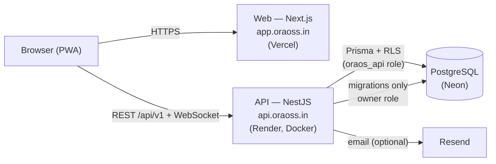

# OraOS

**AI-powered Restaurant Operating System** — point of sale, kitchen display,
inventory, staff, customers, loyalty, analytics, and reporting for a single
restaurant, built multi-tenant from the ground up.

Production: **[app.oraoss.in](https://app.oraoss.in)** (web) ·
**[api.oraoss.in](https://api.oraoss.in)** (API).

Status: **v1.0** — core is complete and hardened for production. See
[docs/PRODUCTION_HARDENING.md](docs/PRODUCTION_HARDENING.md).

---

## Overview

OraOS runs the front and back of house for a restaurant from one app:

- **POS** — server-priced orders, split payments, holds, refunds, coupons, and
  points redemption; guest or identified customer.
- **Kitchen Display** — live kanban over a server-enforced state machine, per-tenant
  realtime, elapsed-time alerts.
- **Inventory** — append-only stock ledger, recipe-driven depletion, weighted-average
  cost, reorder suggestions, procurement / purchase orders.
- **Customers & Loyalty** — phone-identity CRM, deterministic segments, an
  append-only points ledger (earn / redeem / reverse), tiers.
- **Analytics & Reports** — server-aggregated revenue, AOV, peak hours, refunds,
  loyalty and kitchen throughput; custom-range reports with CSV export.
- **Staff** — invite-based onboarding, roles/permissions, append-only attendance.

Every tenant's data is isolated at the database layer with PostgreSQL
Row-Level Security; `restaurant_id` is only ever taken from the verified JWT.

## Architecture



- **Multi-tenant, defence in depth.** Tenant id comes from the verified JWT →
  `AsyncLocalStorage` → `SET LOCAL app.restaurant_id` per transaction → RLS. The
  runtime connects as a least-privilege role (`oraos_api`) that is *subject* to
  RLS; the owner role (with `BYPASSRLS`) is used only for migrations. The two must
  differ or the API refuses to boot.
- **Money is integer minor units (paise)** — never floats. The order identity
  `total = subtotal − discount + tax` is enforced by a DB check.
- **Append-only ledgers** for anything financial or auditable: `audit_logs`,
  `order_events`, `stock_movements`, `loyalty_ledger`. Balances are `SUM(...)`,
  never a cached column.
- **Realtime** is Socket.IO with per-tenant rooms, authenticated by JWT on connect.
- **Web auth**: access token in memory, refresh in a `SameSite=Strict` cookie — so
  web and API must be same-site (`app.` + `api.` under one registrable domain).

Full rationale in [docs/ARCHITECTURE.md](docs/ARCHITECTURE.md) and
[docs/BLUEPRINT.md](docs/BLUEPRINT.md).

## Tech stack

| Layer | Stack |
|---|---|
| Web | Next.js 16 (App Router, PWA), React 19, Tailwind CSS 4, TypeScript |
| API | NestJS 11, Prisma 7 (`@prisma/adapter-pg`), Zod, class-validator, Socket.IO, Pino |
| Database | PostgreSQL (Neon), Row-Level Security |
| Auth | JWT access + rotating refresh tokens, bcrypt, Helmet, nonce CSP |
| Tooling | pnpm workspaces, ESLint, Prettier, Jest, Docker, GitHub Actions CI |

## Project structure

```
oraos/
  apps/
    web/     Next.js PWA — POS, dashboard, all operator UI
    api/     NestJS API — auth, Prisma, RLS, realtime, business logic
  docs/      architecture, deployment, security, runbook, roadmap
  render.yaml         Render Blueprint (API)
  docker-compose.yml  self-host path (migrate → api → web)
```

`packages/` and `apps/ai` (a Python service) are reserved for future shared code
and the Phase-6 AI service — see [docs/ARCHITECTURE.md](docs/ARCHITECTURE.md#10-decisions-deferred-with-trigger).
They are not built yet.

## Requirements

- **Node ≥ 22** and **pnpm 11** (pinned via `packageManager`)
- **PostgreSQL 15+** — Neon in production; any Postgres locally
- Docker + Compose (only for the container / self-host path)

## Development setup

```bash
pnpm install

cp apps/api/.env.example apps/api/.env        # set DATABASE_URL + JWT_SECRET
cp apps/web/.env.example apps/web/.env.local  # set NEXT_PUBLIC_API_URL

pnpm --filter @oraos/api db:migrate           # apply schema
pnpm --filter @oraos/api db:setup-app-role    # create least-privilege role → DATABASE_URL_APP
pnpm --filter @oraos/api db:seed              # roles, permissions, demo data
```

## Environment variables

Only `.env.example` files are tracked; real `.env` files never are. Every variable
is documented in [docs/ENVIRONMENT.md](docs/ENVIRONMENT.md). The essentials:

| App | Variable | Purpose |
|---|---|---|
| api | `DATABASE_URL` | Owner role — **migrations only** (`sslmode=verify-full`) |
| api | `DATABASE_URL_APP` | Least-privilege runtime role; must differ from `DATABASE_URL` |
| api | `JWT_SECRET` | ≥32 chars, unique per env (`openssl rand -base64 48`) |
| api | `CORS_ORIGINS`, `WEB_URL` | Web origin(s); must be `https://` in production |
| api | `RESEND_API_KEY`, `MAIL_FROM` | Email (optional; unset ⇒ email is logged, not sent) |
| web | `NEXT_PUBLIC_API_URL` | Public API URL, baked into the bundle + CSP at build time |

## Running locally

```bash
pnpm --filter @oraos/api dev    # API on :3001
pnpm --filter @oraos/web dev    # Web on :3000

# whole-workspace gates
pnpm typecheck && pnpm lint && pnpm build
pnpm --filter @oraos/api test:e2e     # needs a database
pnpm --filter @oraos/api verify:rls   # tenant-isolation checks
```

## Deployment

Production is **web on Vercel, API on Render, database on Neon**, all under one
registrable domain so the `SameSite=Strict` refresh cookie stays same-site. Full
runbook (rollback, health probes, HTTPS, self-host) in
[docs/DEPLOYMENT.md](docs/DEPLOYMENT.md).

- **Web → Vercel.** Import the repo, set **Root Directory** to `apps/web`, set
  `NEXT_PUBLIC_API_URL=https://api.oraoss.in/api/v1`, add domain `app.oraoss.in`.
  `next.config.ts` detects `VERCEL` and skips the Docker `standalone` output.
- **API → Render.** Deploy the [`render.yaml`](render.yaml) Blueprint (Docker,
  build context = repo root, health check `/api/v1/health`). Fill the `sync:false`
  secrets in the dashboard; add domain `api.oraoss.in`.
- **Database → Neon.** Migrations run as a **separate step before** the API rolls
  out (owner role, always backward-compatible — the zero-downtime rule):

  ```bash
  DATABASE_URL="<neon owner url>" pnpm --filter @oraos/api db:migrate:deploy
  ```

The `docker-compose.yml` self-host path (migrate → api → web) is also supported.

## Contributing

OraOS is proprietary (see [License](#license)); this is the internal workflow, not
an invitation for external contributions.

- Conventional commits. Never commit broken code.
- Every change ends with **lint + typecheck + tests + build green**. CI (GitHub
  Actions) runs all of these plus both Docker builds on every push and PR.
- Never commit a `.env` — only `.env.example` is tracked.
- Read [docs/ARCHITECTURE.md](docs/ARCHITECTURE.md) before adding a module, and the
  non-negotiables in [docs/ROADMAP.md](docs/ROADMAP.md) before touching money,
  tenancy, or auth.

## Roadmap

- **v1** — POS, orders, customers, inventory, staff, kitchen, analytics, AI
  insights, marketing, reports, deployment. ✅ complete.
- **v2** — events infrastructure, loyalty (ledger → earn/redeem/reverse), digital
  receipts, kitchen OS, timeline, business insights, inventory & procurement
  intelligence, CRM, smart checkout. ✅ complete — see
  [docs/ROADMAP_V2.md](docs/ROADMAP_V2.md).
- **Later** — loyalty rewards (cashback/referrals/expiry), notifications, deeper
  analytics (cohort retention, product profitability), the AI assistant, offline
  mode, and multi-branch. Tracked in [docs/BACKLOG.md](docs/BACKLOG.md).

## Known limitations

- **External error alerting (Sentry) is not wired** — errors are logged with a
  request id, but nothing pages an operator. Add alerts before heavy traffic.
- **Realtime is single-instance** — Socket.IO has no shared adapter, so scaling the
  API horizontally needs sticky sessions or a Redis adapter first
  ([docs/RUNBOOK.md](docs/RUNBOOK.md)).
- **AI is rule-based + statistical**, computed in the API. No LLM or Python service
  yet (Phase 6).
- **No offline mode or multi-branch** yet — both are Phase 2+.
- On Neon's free tier the database cold-starts; the first query after idle can take
  a few seconds.

## License

Proprietary — **all rights reserved**. See [LICENSE](LICENSE). Not open source.
